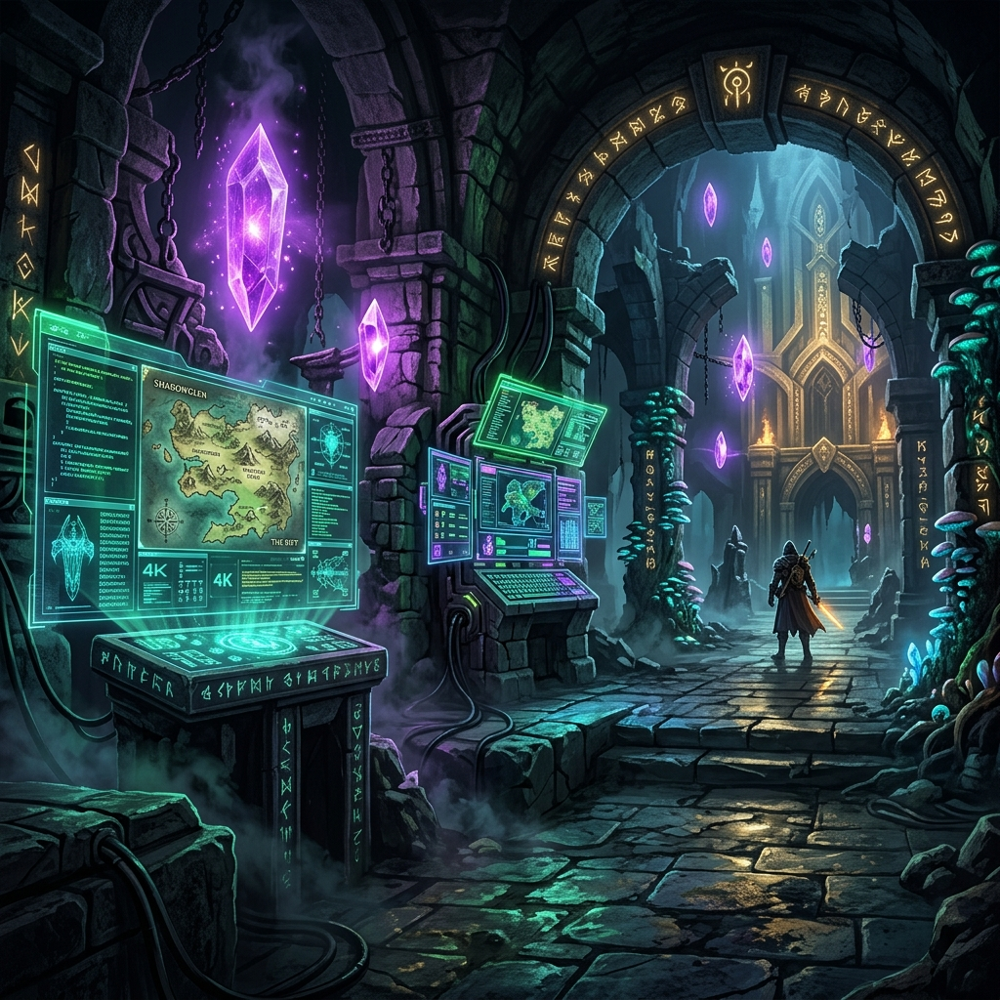
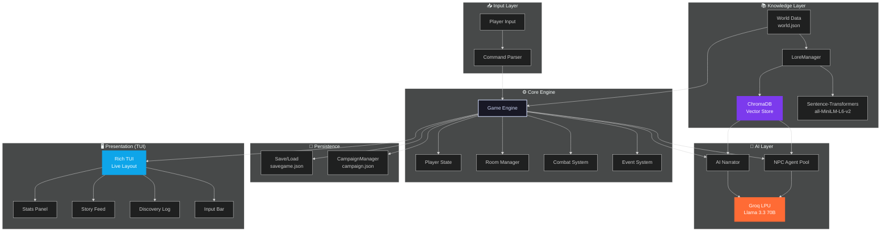

<p align="center">
  
</p>

<h1 align="center">⚡ Adventuring AI Engine ⚡</h1>

<p align="center">
  <strong>An asynchronous, AI-driven terminal RPG and interactive fiction engine.</strong>
</p>

<p align="center">
  <a href="https://www.python.org/"></a>
  <a href="https://groq.com"></a>
  <a href="https://www.trychroma.com/"></a>
  <a href="https://github.com/YEGNESWAR07/Adventuring-AI-Engine/blob/main/LICENSE"></a>
  
  
</p>

---

> [!NOTE]
> Explore a vast 37-room dungeon, converse with intelligent NPCs, equip weapons and armor, fight dynamic turn-based combat, and uncover hidden secrets — all grounded in persistent world lore via RAG and powered by Groq's LPU inference for real-time AI narration (with sub-500ms latency).

**Topics:** `python` `text-adventure` `ai-game` `groq` `rag` `chromadb` `multi-agent` `interactive-fiction` `dungeon-crawler` `async-python` `game-engine` `llm` `pydantic` `rich-tui`

---

## 📊 At a Glance

| Feature | Detail |
| :--- | :--- |
| **🗺️ World Size** | 37 interconnected rooms across 5 distinct zones |
| **🎭 Multi-Agent NPCs** | 6+ unique characters, each powered by an independent Groq agent |
| **📚 RAG Lore Engine** | ChromaDB vector store + `all-MiniLM-L6-v2` embeddings for narrative consistency |
| **💾 Persistent Campaigns** | Cross-session choices, global flags, and quest states saved in JSON |
| **🛡️ Items & Equipment** | 40+ items with weapon/armor/accessory slots & custom stats |
| **⚔️ Combat System** | Dynamic turn-based combat featuring blocking, variable damage, and power states |
| **🧠 AI Narration** | Context-aware, sentiment-reactive storytelling via Groq Llama 3.3 70B |
| **🖥️ Terminal UI** | Sleek Rich TUI featuring real-time input, layout panels, health bars, and mini-map |

---

## 🏗️ System Architecture



### 🧠 Key Design Decisions

*   **⚡ AsyncGroq** — Leveraging asynchronous non-blocking LLM inference via Groq's hardware ensures a sub-500ms narration latency, maintaining a fluid terminal experience.
*   **📚 RAG Grounding** — The `LoreManager` connects to ChromaDB and embeds queries using `all-MiniLM-L6-v2` to fetch lore snippets, providing factual grounding for the LLM.
*   **🤖 Multi-Agent NPCs** — NPCs are powered by individual `NPCAgent` instances with independent conversation memory, system personas, and distinct narrative goals.
*   **💾 Campaign Persistence** — Branching storylines are enabled by tracking global flags across game sessions, meaning NPCs react to your past decisions.
*   **🛡️ Pydantic Verification** — Safe loading of `world.json` data structured using strict Pydantic schemas, ensuring fail-fast runtime safety.

---

## ✨ Features

### 📚 RAG-Based World Lore
*   **Vectorized Lore Database**: The `LoreManager` indexes world history, character bios, and item legends into ChromaDB automatically on the first run.
*   **Grounded Narration**: Room descriptions and item examinations are automatically enriched with relevant retrieved lore snippets.
*   **Persistent Storage**: Lore embeddings persist under `data/lore_db/` so they are indexed only once and reused.

### 🎭 Multi-Agent NPC System
*   **Independent Personalities**: Characters like *Merchant Vex*, *Oracle Mira*, *Shadow Thief*, *Guardian Kael*, *Bard Lyric*, and the *Lost Soul* run on independent Groq models with distinct system prompts.
*   **Natural Language Conversations**: Type naturally to chat: `talk vex what do you know about the dragon?`
*   **Persistent Memories**: NPCs retain short-term memory of previous statements within the active session.
*   **Autonomous Movement**: Wandering NPCs move through the rooms every 5 turns, creating unexpected encounters.

### 📜 Persistent Campaign Mode
*   **Decision Tracking**: Global choices and actions are preserved in `data/campaign.json`.
*   **Global Reaction Flags**: Defeating bosses or choosing aggressive actions sets permanent world flags that shift NPC alignments and narration tone.
*   **Branching Narratives**: Current campaign states are dynamically appended to conversation context prompts.

### 🧠 Context-Aware AI Narration
*   **Real-time Inference**: Narrative generation uses `llama-3.3-70b-versatile` to produce highly detailed, sensory descriptions.
*   **Player Sentiment Reaction**: Narrator adapts to your recent playstyle. Aggressive play darkens descriptions, while low health changes room narration into a surreal, feverish nightmare.
*   **Static Fallback**: Safe fallback to static description configurations if Groq is offline.

### ⚔️ Dynamic RPG Combat
*   **Variable Battle Math**: Combat features random damage spreads (Player: 8–18, Enemy: 5–15).
*   **Shield Mechanics**: Equipping shields triggers a block chance of up to 50%, negating attack damage.
*   **Combat Statuses**: Items like `crystal focus` activate temporary stat buffs (e.g. 5 turns of 1.5× damage).

### 🖥️ Immersive Rich TUI
*   **Quad-Panel Interface**:
    *   **Left**: Mini-map and player stats (real-time HP bars, current room, status effects).
    *   **Center**: Real-time story feed rendering AI-generated room details and combat logs.
    *   **Right**: Discovery log tracking found keys, met characters, and inventory.
    *   **Bottom**: Real-time keystroke capture input.
*   **Visual Indicators**: Live generation typing animation (`✦ The narrator is weaving the story...`) and color-coded panel borders based on HP status (Blue $\rightarrow$ Yellow $\rightarrow$ Red).

### 📸 TUI Terminal Preview

```text
 ╔═════════════════════════════════════════════════════════════════════════════════════════════════════════╗
 ║  HP: [████████████████████] 100/100  |  Turns: 12  |  Zone: Ancient Ruins  |  Room: Whispering Gallery  ║
 ╚═════════════════════════════════════════════════════════════════════════════════════════════════════════╝
 
 [ STORY FEED ]
 ✦ The air grows chill as you step into the room. Glowing cyan runes line the stone arches, casting long
   shadows across a central altar. In the darkness, you hear a soft, metallic whisper...
 
 [ EXAMINING ALTAR ]
 ✦ (RAG Lore retrieved: The Altar of the Star-Watchers was used to study the stellar alignments...)
   The altar is crafted from a dark, meteoritic metal. Its surface is engraved with intricate stellar
   charts. A slight hum vibrates through the stone floor when you touch it.
 
 💬 Merchant Vex: "Welcome, traveler. Looking for something to survive the deeper levels? I have just
   what you need... for a price."
   
 👤 Type your command: > talk vex do you have a shield?
```

---

## 🗺️ Dungeon World Map (37 Rooms)

The game features 37 interconnected rooms divided into 5 major zones.

```text
                                    Oracle's Chamber
                                          │
                                        Bazaar
                                        ╱
                               Healing Spring
                                   │
    Cave Entrance → Rocky Path → Narrow Passage → Goblin Cavern ──→ Crossroads ──────────────┐
                                                       │                │                     │
                                                       ▼           ┌────┼────┬────┐          down
                                                   Ancient Vault    │    │    │    │            │
                                                                    ▼    ▼    ▼    ▼            ▼
                                    Treasure Chamber ←─ Goblin   Armory Lake Library    Deep Tunnels
                                                                    │         │    │      │    │    │
                                                               Echoing Hall   │  Fungal  │  Spider Shadow
                                                                    │         │  Caverns │  Nest  Thief
                                                               Hidden Passage │    │     │    │    Lair
                                                                    │       Verdant│  Crystal │
                                                               Dragon's Lair Cavern│   Cave  Bone
                                                                    │              │    │     Pit
                                                               Escape Tunnel       │  Lava
                                                                    │          Collapsed Bridge
                                                               Sunlit Valley   Tunnel    │
                                                               ═══════════           Underground
                                                                (VICTORY)              River
                                                                                        │
                                                                               Forgotten City Gates
                                                                               │              │
                                                                          Silent Grove   Market Ruins
                                                                                              │
                                                                                        Training Ground
                                                                                         │         │
                                                                                     Treasury   Tomb of Kings
                                                                                         │         │
                                                                                         └──→ Ritual Chamber
```

> [!TIP]
> 🌅 **Path to Victory:** Cave Entrance $\rightarrow$ Rocky Path $\rightarrow$ Narrow Passage $\rightarrow$ Goblin Cavern $\rightarrow$ Crossroads $\rightarrow$ Ancient Library $\rightarrow$ Hidden Passage $\rightarrow$ Dragon's Lair $\rightarrow$ Escape Tunnel $\rightarrow$ **Sunlit Valley**

---

## 🛠️ Tech Stack

| Category | Component | Description |
| :--- | :--- | :--- |
| 🐍 **Language** | Python 3.12+ | Core runtime and engine codebase |
| ⚡ **AI Inference** | Groq SDK (`AsyncGroq`) | Real-time narrative synthesis using `llama-3.3-70b-versatile` |
| 🗄️ **Vector Database** | ChromaDB (Persistent Client) | Stores and queries lore embeddings locally |
| 🧠 **Embeddings** | Sentence-Transformers | Uses `all-MiniLM-L6-v2` for semantic search of world lore |
| 🛡️ **Validation** | Pydantic v2 | Ensures structural sanity of JSON databases |
| 🖥️ **Terminal UI** | Rich 14+ | Renders panel grids, progress HP bars, and text styling |
| 🔄 **Concurrency** | `asyncio` | Manages non-blocking input, NPC roam ticks, and API calls |
| 🧪 **Unit Testing** | `pytest` | Suite of 144 unit tests validating game loop integrity |

---

## 📁 Directory Structure

```text
adventuring-ai-engine/
├── .env                        # Local environment credentials (API keys)
├── .gitignore                  # Git patterns to exclude from commits
├── requirements.txt            # Python package dependencies
├── README.md                   # This overview file
├── assets/
│   └── banner.png              # Title artwork
├── data/
│   ├── world.json              # Main game room graph & NPC data (Pydantic-validated)
│   ├── lore_db/                # Local ChromaDB persistent database
│   └── campaign.json           # Stores persistent game flags across playthroughs
├── src/
│   ├── models.py               # Pydantic schemas (WorldData, RoomData, NPCData, LoreData)
│   ├── engine.py               # Core mechanics (Game, Player, World, CampaignManager)
│   ├── lore_manager.py         # RAG loader (embeddings & vector search)
│   ├── npc_agent.py            # AI conversational brains for NPCs
│   ├── narrator.py             # LLM narrator, hint generator & sensory desc
│   ├── ui.py                   # Layout structure and rendering controls
│   └── main.py                 # Primary entry point & command line parser
└── tests/
    └── test_engine.py          # Regression tests verifying mechanics
```

---

## 🚀 Installation & Setup

### Prerequisites
*   **Python 3.12+** installed on your system.
*   A **Groq API Key** (obtainable for free at [console.groq.com](https://console.groq.com)).

### Step-by-Step Installation

1. **Clone the Repository:**
   ```bash
   git clone https://github.com/YEGNESWAR07/Adventuring-AI-Engine.git
   cd Adventuring-AI-Engine
   ```

2. **Initialize a Virtual Environment:**
   ```bash
   python -m venv .venv
   ```
   *   **On Windows:**
       ```bash
       .venv\Scripts\activate
       ```
   *   **On macOS/Linux:**
       ```bash
       source .venv/bin/activate
       ```

3. **Install Dependencies:**
   ```bash
   pip install -r requirements.txt
   ```

4. **Configure Environment Variables:**
   Create a `.env` file in the project root and add your Groq API key:
   ```env
   GROQ_API_KEY=gsk_your_key_here
   ```

5. **Start the Game:**
   ```bash
   python -m src.main
   ```

6. **Run the Test Suite:**
   Ensure everything is operating correctly:
   ```bash
   python -m pytest tests/ -v
   ```

---

## 🎮 Command Guide

| Action | Commands | Description |
| :--- | :--- | :--- |
| **Movement** | `n` / `s` / `e` / `w` / `ne` / `nw` | Travel between rooms in specified directions |
| **Observation** | `look` | Force-refresh and reread room details |
| **Lore Examination** | `examine <item>` | Analyze items using RAG lore embeddings |
| **Interaction** | `talk <npc> [message]` | Engage in conversation with an NPC in room |
| **Inventory Management** | `inventory` / `i` | View all items in your pack |
| | `pickup <item>` | Take an item from the current room |
| | `drop <item>` | Drop an item from inventory to current room |
| **Equipment** | `equip <item>` | Wear/hold weapons, armor, or rings |
| **Searching** | `search` | Investigate current room for hidden loot |
| **Healing** | `use <item>` | Consume healing potions, salves, or elven bread |
| **Combat** | `attack` / `fight` | Initiate dynamic battle against room monsters |
| **Save / Load** | `save` / `load` | Save or restore session progress |
| **System** | `help` | Show command helper menu |
| | `quit` / `exit` | Terminate game safely |

---

## 📜 License

<details>
<summary><b>MIT License (Click to expand)</b></summary>

```
MIT License

Copyright (c) 2026 Pallapothu Yegneswar Gupta

Permission is hereby granted, free of charge, to any person obtaining a copy of this software and associated documentation files (the "Software"), to deal in the Software without restriction, including without limitation the rights to use, copy, modify, merge, publish, distribute, sublicense, and/or sell copies of the Software, and to permit persons to whom the Software is furnished to do so, subject to the following conditions:

The above copyright notice and this permission notice shall be included in all copies or substantial portions of the Software.

THE SOFTWARE IS PROVIDED "AS IS", WITHOUT WARRANTY OF ANY KIND, EXPRESS OR IMPLIED, INCLUDING BUT NOT LIMITED TO THE WARRANTIES OF MERCHANTABILITY, FITNESS FOR A PARTICULAR PURPOSE AND NONINFRINGEMENT. IN NO EVENT SHALL THE AUTHORS OR COPYRIGHT HOLDERS BE LIABLE FOR ANY CLAIM, DAMAGES OR OTHER LIABILITY, WHETHER IN AN ACTION OF CONTRACT, TORT OR OTHERWISE, ARISING FROM, OUT OF OR IN CONNECTION WITH THE SOFTWARE OR THE USE OR OTHER DEALINGS IN THE SOFTWARE.
```
</details>
