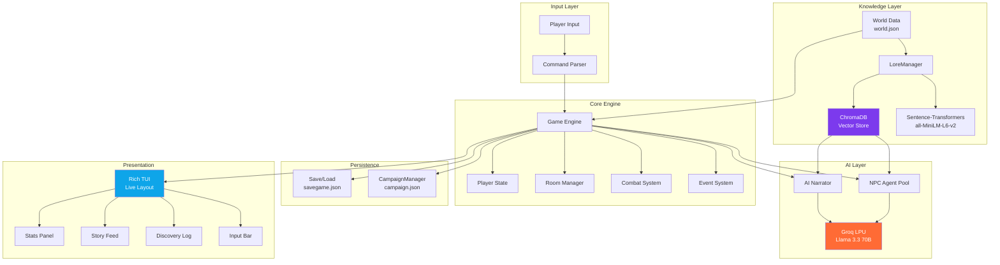

# Adventuring AI Engine ⚡


[](https://groq.com)
[](https://www.trychroma.com/)


> **An async AI-powered terminal-based interactive fiction engine.**  
> Explore a vast 37-room dungeon, converse with intelligent NPCs, equip weapons and armor, fight dynamic turn-based combat, and uncover hidden secrets — all grounded in persistent world lore via RAG and powered by Groq's LPU inference for real-time AI narration.

**Topics:** `python` `text-adventure` `ai-game` `groq` `rag` `chromadb` `multi-agent` `interactive-fiction` `dungeon-crawler` `async-python` `game-engine` `llm` `pydantic` `rich-tui`

---

## 📊 At a Glance

| Feature | Detail |
|---------|--------|
| **World Size** | 37 interconnected rooms across 5 zones |
| **Multi-Agent NPCs** | 6+ unique characters, each powered by its own Groq agent |
| **RAG Lore Engine** | ChromaDB vector store with Sentence-Transformers for lore-consistent narration |
| **Persistent Campaigns** | Cross-session tracking of choices, flags, and narrative state |
| **Items & Equipment** | 40+ items with weapon/armor/accessory slots and RAG-grounded descriptions |
| **Combat** | Dynamic turn-based with blocking, empowerment, and variable damage |
| **AI Narration** | Groq Llama 3.3 70B — context-aware, sentiment-reactive storytelling |
| **Terminal UI** | Rich TUI with live panels, HP bars, mini-map, and real-time input |

---

## 🏗️ System Architecture



### Key Design Decisions

- **AsyncGroq** — Non-blocking LLM inference via Groq's LPU™ hardware; sub-500ms narration latency keeps the TUI responsive.
- **RAG Grounding** — `LoreManager` uses ChromaDB + `all-MiniLM-L6-v2` embeddings to retrieve relevant world lore before every AI call, ensuring narrative consistency.
- **Multi-Agent Architecture** — Each NPC gets its own `NPCAgent` instance with independent conversation memory, system prompt, and goals.
- **Campaign Persistence** — `CampaignManager` tracks global flags across sessions, enabling branching narratives that evolve over multiple playthroughs.
- **Pydantic v2 Validation** — `WorldData`, `RoomData`, `NPCData`, and `LoreData` models validate `world.json` at load, catching malformed data before runtime.

---

## ✨ Features

### 📚 RAG-based World Lore
- **Vectorized Lore Database** — The `LoreManager` indexes world history, character bios, and item legends into ChromaDB on first run.
- **Grounded Narration** — Room descriptions and item examinations are automatically enriched with retrieved lore snippets, creating a rich, consistent world.
- **Persistent Storage** — Lore embeddings persist in `data/lore_db/` — indexed once, reused across all sessions.

### 🎭 Multi-Agent NPC System
- **Independent Personalities** — Each NPC (Merchant Vex, Oracle Mira, Shadow Thief, Guardian Kael, Bard Lyric, Lost Soul) runs its own Groq agent with unique system prompts and goals.
- **Natural Language Dialogue** — Converse freely: `talk vex what do you know about the dragon?`
- **Conversation Memory** — NPCs remember what you've said within a session, enabling multi-turn dialogue.
- **Autonomous Roaming** — Non-merchant NPCs move through the world every 5 turns, creating dynamic encounters.

### 📜 Persistent Campaign Mode
- **Session Tracking** — The `CampaignManager` records choices, discovered secrets, and world-altering events in `data/campaign.json`.
- **Global Flags** — Defeating enemies, finding legendary items, or choosing violence sets permanent flags that influence NPC reactions across runs.
- **Branching Narrative** — Campaign state is injected into NPC dialogue context, so characters acknowledge your history.

### 🧠 Context-Aware AI Narration
- **Real-time Groq inference** via `llama-3.3-70b-versatile` — each room generates a unique, sensory-rich description.
- **Sentiment Memory** — The narrator tracks your last 3 actions. Aggressive play darkens the atmosphere; low HP triggers surreal, fever-dream descriptions.
- **Lore Integration** — Room and item descriptions are grounded in retrieved world lore before the LLM generates text.
- **Graceful Fallback** — Returns `static_description` from `world.json` if the API is unavailable.

### ⚔️ Dynamic Combat System
- **Variable Damage** — Player attacks deal 8–18 damage; enemies deal 5–15. Every fight is unpredictable.
- **Shield Blocking** — Equipping a shield grants up to 50% block chance; blocked attacks deal zero damage.
- **Empowered State** — Using the `crystal focus` grants a 5-turn 1.5× damage multiplier.
- **Enemy Defeat** — Strong hits can instantly defeat enemies. Defeated foes are tracked in campaign state.

### 🖥️ Real-Time TUI
- **Rich `Live` display** with a four-panel layout:
  - **Left**: Player stats (HP bar, turn counter, room, active effects) + mini-map
  - **Center**: AI story feed with room items & enemies inline
  - **Right**: Discovery log (items collected + NPCs met)
  - **Bottom**: Real-time input bar with character-by-character keystroke capture
- **Typing Indicator** — Shows `✦ The narrator is weaving the story...` during AI generation.
- **Dynamic Borders** — Panel borders change color based on health (blue → yellow → red).
- **Live AI Hints** — Linger 3+ turns and a mysterious voice whispers Groq-generated hints.

---

## 🗺️ World Map (37 Rooms)

```
                                    Oracle's Chamber
                                          │
                                        Bazaar
                                        ╱
                              Healing Spring
                                  │
    Cave Entrance → Rocky Path → Narrow Passage → Goblin Cavern ──→ Crossroads ──────────────┐
                                                       │                │                     │
                                                       ▼           ┌────┼────┬────┐          down
                                                  Ancient Vault    │    │    │    │            │
                                                                   ▼    ▼    ▼    ▼            ▼
                                    Treasure Chamber ←─ Goblin   Armory Lake Library    Deep Tunnels
                                                                   │         │    │      │    │    │
                                                              Echoing Hall   │  Fungal  │  Spider Shadow
                                                                   │         │  Caverns │  Nest  Thief
                                                              Hidden Passage │    │     │    │    Lair
                                                                   │       Verdant│  Crystal │
                                                              Dragon's Lair Cavern│   Cave  Bone
                                                                   │              │    │     Pit
                                                              Escape Tunnel       │  Lava
                                                                   │          Collapsed Bridge
                                                              Sunlit Valley   Tunnel    │
                                                              ═══════════           Underground
                                                               (VICTORY)              River
                                                                                       │
                                                                              Forgotten City Gates
                                                                              │              │
                                                                         Silent Grove   Market Ruins
                                                                                             │
                                                                                       Training Ground
                                                                                        │         │
                                                                                    Treasury   Tomb of Kings
                                                                                        │         │
                                                                                        └──→ Ritual Chamber
```

> **Path to Victory:** Cave Entrance → Rocky Path → Narrow Passage → Goblin Cavern → Crossroads → Ancient Library → Hidden Passage → Dragon's Lair → Escape Tunnel → **Sunlit Valley** 🌅

---

## 🛠️ Tech Stack

| Component | Technology |
|-----------|-----------|
| **Language** | Python 3.12+ |
| **AI Inference** | Groq SDK (`AsyncGroq`) — Llama 3.3 70B Versatile |
| **Vector Database** | ChromaDB (Persistent Client) |
| **Embeddings** | Sentence-Transformers (`all-MiniLM-L6-v2`) |
| **Data Validation** | Pydantic v2 |
| **Terminal UI** | Rich 14+ (`Live`, `Layout`, `Panel`, `Bar`) |
| **Async Runtime** | `asyncio` |
| **Environment** | `python-dotenv` |
| **Testing** | `pytest` |

---

## 📁 Project Structure

```
adventuring-ai-engine/
├── .env                        # API keys (git-ignored)
├── .gitignore                  # Security exclusions
├── requirements.txt            # Python dependencies
├── README.md
├── data/
│   ├── world.json              # 37-room game world (Pydantic-validated)
│   ├── lore_db/                # ChromaDB persistent storage (auto-generated)
│   └── campaign.json           # Campaign state (auto-generated)
├── src/
│   ├── __init__.py
│   ├── models.py               # Pydantic schemas (WorldData, RoomData, NPCData, LoreData)
│   ├── engine.py               # Core logic (Game, Player, World, CampaignManager)
│   ├── lore_manager.py         # RAG engine (ChromaDB + embeddings)
│   ├── npc_agent.py            # Multi-agent NPC dialogue (AsyncGroq per NPC)
│   ├── narrator.py             # AI narrator (room descriptions, hints, encounters)
│   ├── ui.py                   # Rich TUI layout and components
│   └── main.py                 # Async entry point + game loop
└── tests/
    └── test_engine.py          # 144 unit tests
```

---

## 🚀 Installation & Setup

### Prerequisites
- **Python 3.12+**
- **Groq API key** — free at [console.groq.com](https://console.groq.com)

### Quick Start

```bash
# Clone
git clone https://github.com/YEGNESWAR07/Adventuring-AI-Engine.git
cd Adventuring-AI-Engine

# Install dependencies
pip install -r requirements.txt

# Configure API key
echo GROQ_API_KEY=gsk_your_key_here > .env

# Play
python -m src.main
```

### Run Tests

```bash
python -m pytest tests/ -v
```

---

## 🎮 Gameplay Commands

| Command | Description |
|---------|-------------|
| `n` / `s` / `e` / `w` / `ne` / `nw` | Move in a direction |
| `look` | Re-examine the current room |
| `talk <npc> [message]` | Talk to an NPC using natural language |
| `examine <item>` | Inspect an item with RAG-grounded lore |
| `inventory` / `i` | Show carried items |
| `use <item>` | Use an item (heal, illuminate, empower, etc.) |
| `equip <item>` | Equip a weapon, armor, or accessory |
| `search` | Search the room for hidden items |
| `pickup <item>` | Pick up an item |
| `drop <item>` | Drop an item |
| `attack` / `fight` | Engage enemies in combat |
| `save` | Save game state to disk |
| `load` | Restore game state from disk |
| `help` | Display command reference |
| `quit` / `exit` | Exit the game |

---

## 📜 License

```
MIT License

Copyright (c) 2025 Pallapothu Yegneswar Gupta

Permission is hereby granted, free of charge, to any person obtaining a copy
of this software and associated documentation files (the "Software"), to deal
in the Software without restriction, including without limitation the rights
to use, copy, modify, merge, publish, distribute, sublicense, and/or sell
copies of the Software, and to permit persons to whom the Software is
furnished to do so, subject to the following conditions:

The above copyright notice and this permission notice shall be included in all
copies or substantial portions of the Software.

THE SOFTWARE IS PROVIDED "AS IS", WITHOUT WARRANTY OF ANY KIND, EXPRESS OR
IMPLIED, INCLUDING BUT NOT LIMITED TO THE WARRANTIES OF MERCHANTABILITY,
FITNESS FOR A PARTICULAR PURPOSE AND NONINFRINGEMENT. IN NO EVENT SHALL THE
AUTHORS OR COPYRIGHT HOLDERS BE LIABLE FOR ANY CLAIM, DAMAGES OR OTHER
LIABILITY, WHETHER IN AN ACTION OF CONTRACT, TORT OR OTHERWISE, ARISING FROM,
OUT OF OR IN CONNECTION WITH THE SOFTWARE OR THE USE OR OTHER DEALINGS IN THE
SOFTWARE.
```
